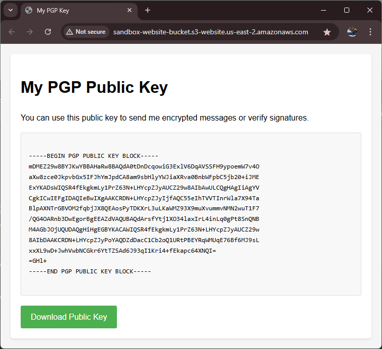

## How to create a static website

Tutorial to create a simple website that shows PGP public key.
Gives users option to download the public key file.

### Set up your new repo
1. Set up a new git repo
```sh
mkdir 
cd my-repo-name
git init
```

2. Create a `.gitignore` file:
```sh
echo "*.DS_Store" > .gitignore
echo "*.env" >> .gitignore
```

3. Create the new repo on Github
* Go to github.com
* Click the '+' icon in the top right
* Select "New repository"
* Name it "sandbox-website"
* Don't initialize the repo with README. Click "Create repository"
```sh
git remote add origin https://github.com/YOUR-USERNAME/my-repo-name.git
git branch -M main
git add .gitignore
git commit -m "Initial commit of .gitignore"
git push -u origin main
```

### Create website content
Here's a
1. Create `index.html` with webpage content. It can be anything. Below is an example which shows your PGP public key as text
```html
<!DOCTYPE html>
<html lang="en">
<head>
    <meta charset="UTF-8">
    <meta name="viewport" content="width=device-width, initial-scale=1.0">
    <title>My PGP Key</title>
    <style>
        body {
            font-family: Arial, sans-serif;
            line-height: 1.6;
            max-width: 800px;
            margin: 0 auto;
            padding: 20px;
            background-color: #f5f5f5;
        }
        .key-container {
            background-color: white;
            padding: 20px;
            border-radius: 5px;
            box-shadow: 0 2px 4px rgba(0,0,0,0.1);
        }
        .pgp-key {
            background-color: #f8f8f8;
            padding: 15px;
            border: 1px solid #ddd;
            border-radius: 3px;
            font-family: monospace;
            white-space: pre-wrap;
            word-wrap: break-word;
        }
        .download-button {
            display: inline-block;
            background-color: #4CAF50;
            color: white;
            padding: 10px 20px;
            text-decoration: none;
            border-radius: 3px;
            margin-top: 20px;
        }
        .download-button:hover {
            background-color: #45a049;
        }
    </style>
</head>
<body>
    <div class="key-container">
        <h1>My PGP Public Key</h1>
        <p>You can use this public key to send me encrypted messages or verify signatures.</p>
        
        <div class="pgp-key">
-----BEGIN PGP PUBLIC KEY BLOCK-----
[Your PGP public key goes here]
-----END PGP PUBLIC KEY BLOCK-----
        </div>

        <a href="pubkey.asc" class="download-button">Download Public Key</a>
    </div>
</body>
</html>
```

2. If you don't have your PGP public key handy, create a new PGP key pair, then copy the public key into the placeholder in `index.html`
```sh
gpg --full-generate-key
gpg --armor --export your.email@example.com > pubkey.asc
cat pubkey.asc  # Copy this into the placeholder inside `index.html`
```

3. Save both `index.html` and `pubkey.asc` in top-level folder of your repo



